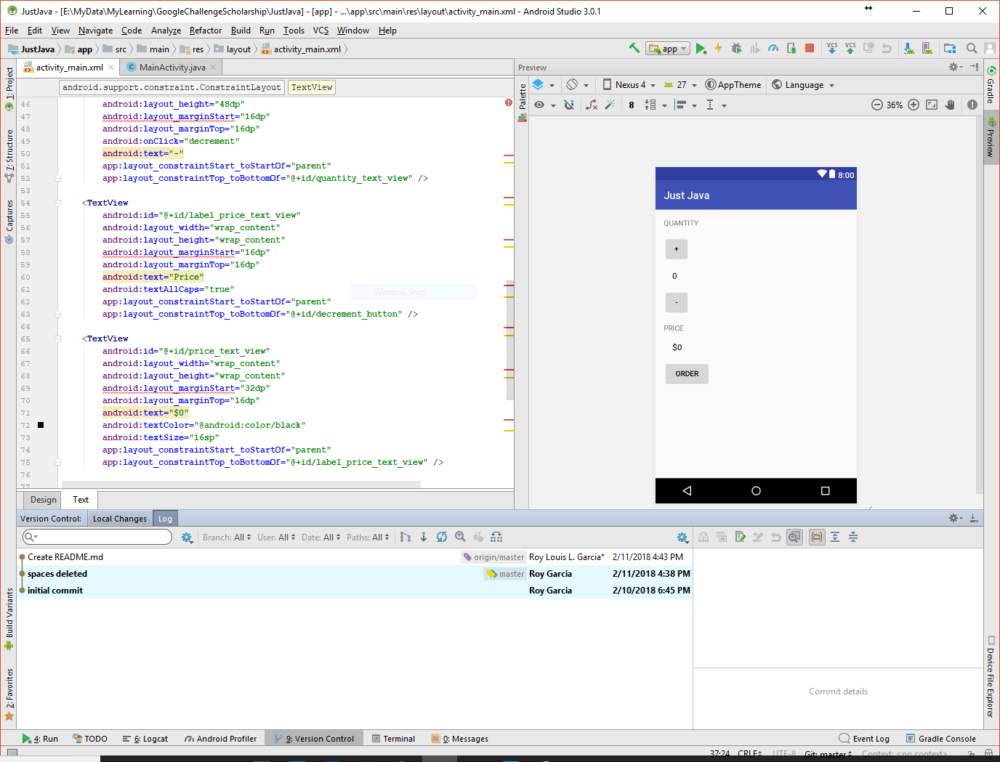

# Just Java 

This repository is a project that I created for a Udacity course. This is my attempt to integrate Android Studio's VCS and compare how working on the GUI IDE will propagate my local and remote git. 

### Prerequisites

1. To create the project, I had been following the lectures to make an interactive android app as part of Udacity's Grow With Google Challenge Scholarship: Android Basics [Udacity](https://www.udacity.com/grow-with-google)
2. I used Android Studio IDE to create the project locally on my Windows 10 machine.
3. I created [Github Just Java Project repo](https://github.com/roylouislgarcia/justJava.git) on Github as an empty repository.
4. I used the program "Github Desktop" for Win10 to link this remote git to the local folder I created for the projects. 

### Screenshot of the project

## Author

Roy Louis L. Garcia

